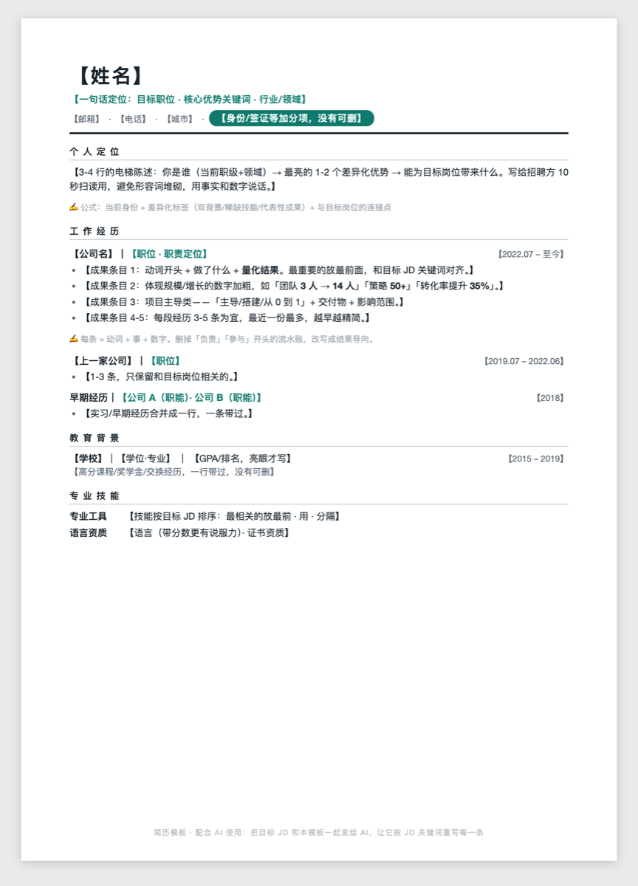
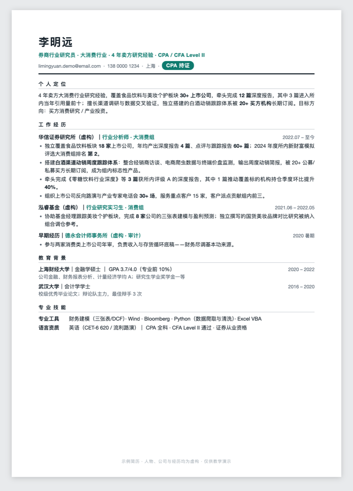
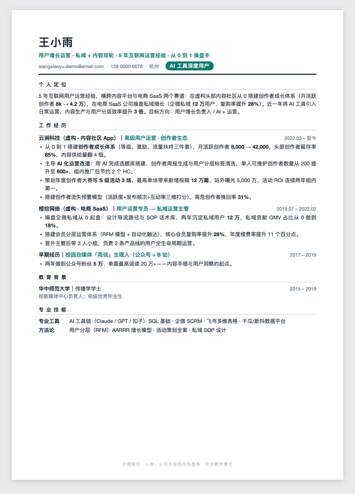
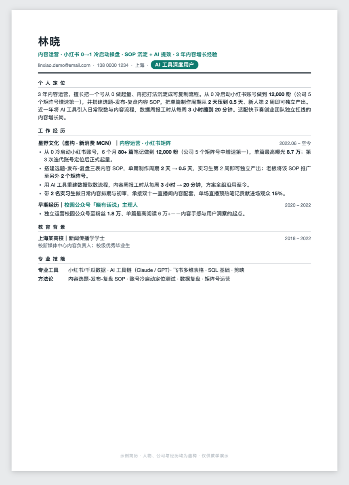

# MintSu Resume · 薄荷简历

写简历和改简历的**全流程 AI skill**：从盘点你的经历，到按岗位定制，到出成品 PDF，一条链跑完。

> 它不是只管排版好看的简历工具。方法论来自投行的简历标准（一页纸、每一行都要有数字、每一个字都要值钱）+ 多年帮人改简历的实战经验。

## 它帮你做三件事

| 步骤 | 做什么 | 产出 |
|---|---|---|
| ① 经历输入 + 量化盘点 | **先引导你把材料全丢进来**（旧简历、周报日报、项目记录、绩效自评、夸你的聊天记录…），再像资深前辈一样追问：影响多大？多少人用？省了多少钱？把"负责XX"的流水账挖成带数字的价值 | 经历素材表（只加不改，你职业生涯的账本）+ 通用简历母版 |
| ② 按 JD 定制 | 提取目标岗位 15-20 个关键词，同一段经历按这个岗位最在乎的角度重新讲——投产品讲闭环，投运营讲增长 | 岗位定制版简历内容 |
| ③ 生成 PDF | 内置调好的 HTML 模板（A4 单页），改任何一行版式不乱，浏览器一键导出 | 可直接投递的 PDF |

**写死的红线：只换表述，永不虚构。** 每一条写进简历的内容，都必须是你真实做过、面试敢被追问的。

## 效果展示

内置模板长这样——A4 单页、深青强调色、数字加粗，直接浏览器导出 PDF 即可投递：

| 通用模板（占位符版） | 金融方向示例 | 运营方向示例 |
|---|---|---|
|  |  |  |
| 每个板块附写作公式提示 | 券商研究员 · 报告与覆盖数量说话 | 用户增长 · 私域与转化数字说话 |

下面这份是**完整跑一遍三步流程**的产出：一位内容运营把旧简历和周报丢进来，经过量化追问 → 按一份内容运营 JD 定制 → 出 PDF。注意每条 bullet 都带数字，且都是追问出来的真实结果，而不是形容词：

<p align="center"></p>

> 图中人物、公司与经历**均为虚构**，仅用于演示排版与写法。

## 安装

任选其一：

**方式 1（最简单）**：把本仓库链接发给你的 AI 编程助手（Claude Code / Codex / WorkBuddy 等），说：

```
帮我安装这个 skill，然后用它帮我改简历
```

**方式 2（手动）**：
```bash
git clone https://github.com/MintSuAI/mintsu-resume-skill.git
cp -r mintsu-resume-skill ~/.claude/skills/mintsu-resume
```

## 使用

装好后直接对 AI 说：
- 「帮我写简历」——从零开始，走完整三步
- 「这是我的旧简历和一个 JD，帮我改」——直接进第二步
- 「把这段实习加上」「换成数据方向再出一版」——增量修改

## 内置模板

`templates/` 里有三套（示例人物均为虚构，仅供参考格式，预览见上方[效果展示](#效果展示)）：
- 通用模板（占位符 + 每个板块的写作公式提示）
- 金融方向成品示例
- 运营方向成品示例

## Roadmap

- [ ] 模拟面试模块：拿定稿简历让 AI 扮演目标岗位面试官，提前暴露答不上来的地方

## 作者

**MintSu（薄荷苏）** —— 跟薄荷一起学实用 AI。

MIT License
